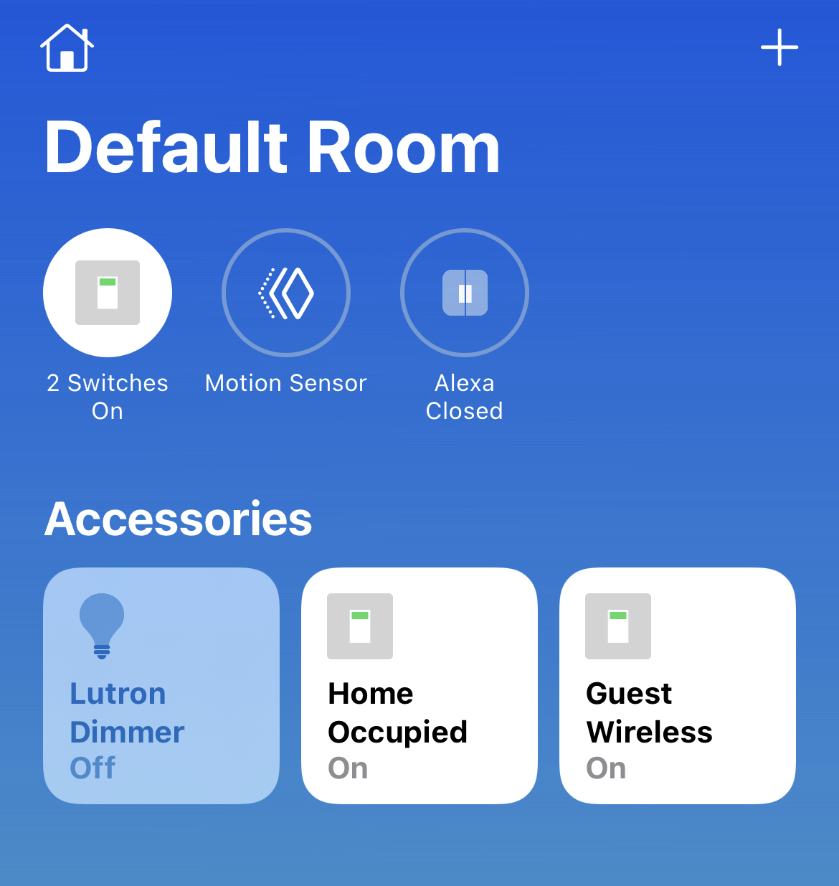

# A [Cisco Meraki](https://meraki.cisco.com) Wireless plugin for [Homebridge](https://github.com/nfarina/homebridge).  

This creates a Light Switch in homekit for the status of an SSID using the Meraki Dashboard API.

# Installation
Run these commands:

    % sudo npm install -g homebridge
    % sudo npm install -g homebridge-meraki-mr

NOTE: If you install homebridge like this:

    sudo npm install -g --unsafe-perm homebridge

Then all subsequent installations must be like this:

    sudo npm install -g --unsafe-perm homebridge-meraki-mr

# Configuration
Example accessory config (needs to be added to the homebridge config.json):
 ...

	"platforms": [
		{
			"name": "Meraki WiFi",
			"apiKey": "4854372bf7b61bdb701512314e3134bcb3e61b85",
			"timeout": 10000,
			"refreshInterval": 60000,
			"debug": false;
			"networks": [
				{
					"displayName": "Site 1",
					"networkId": "L_012345678901234501"
				},
				{
					"displayName": "Site 2",
					"networkId": "L_012345678901234502"
				}
			],
			"platform": "Meraki MR"
		}
	]
 ...

### Config Explanation:

Field           						| Description
----------------------------|------------
**platform**	   						| (required) Must always be "Meraki MR".
**name**										| (required) The internal name you want to use for the platform within Homebridge.
**apiKey**									| (required) The Meraki API Key used to access the Meraki Dashboard.
**timeout**									| (optional) The timeout duration in ms for the web API calls.
**refreshInterval**					| (optional) The refresh interval in minutes for polling the WiFi status.
**debug**										| (optional) Enables additional logging.
**displayName**							| (required) The name you want to show for the WLC in homekit.
**networkId**								| (required) The Meraki Network ID for the site or network.

To make your Meraki Dashboard account work with the plugin:

1. Login to your Meraki Dashboard account.
2. In the Dashboard, go to Organization / Settings.
3. Scroll down to the bottom and Enable access to the Cisco Meraki Dashboard API.
4. Save Changes, then scroll to the top, click on your username on the right & click My Profile.
5. Scroll down towards the bottom and under API Access, click on Generate API Key.
6. Write down or copy the API Key.
7. In the same browser, go to https://api.meraki.com/api/v0/organizations
8. Use the resulting org id to browse to https://https://api.meraki.com/api/v0/organizations/{orgID}/networks
9. Write down the network id(s) for the network(s) that you want to control.
10. Create your config file according to the above example (or using the Homebridge UI).

# More information
Check out https://github.com/nfarina/homebridge for more information about Homebridge.

